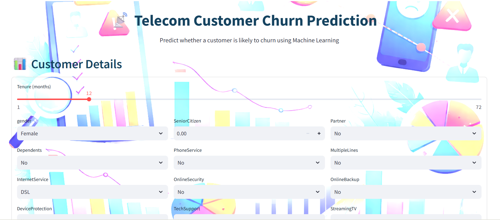
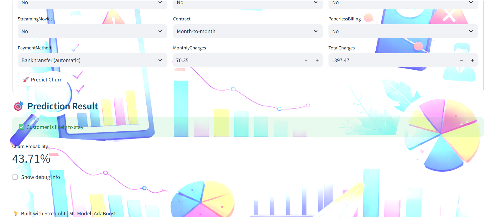

#       📡 Telecom Customer Churn Prediction

<div align="center">
  


*A machine learning web application that predicts whether a telecom customer is likely to churn.*

</div>

---

## 📸 Application Screenshots

<div align="center">





</div>

---

## 📋 Table of Contents

- [🎯 Project Overview](#-project-overview)
- [✨ Features](#-features)
- [🛠️ Technologies Used](#️-technologies-used)
- [📊 Dataset](#-dataset)
- [🤖 Model Details](#-model-details)
- [📓 Jupyter Notebooks](#-jupyter-notebooks)
- [🚀 Quick Start](#-quick-start)
- [🔄 Usage](#-usage)
- [📁 Project Structure](#-project-structure)
- [📈 Future Improvements](#-future-improvements)
- [📄 License](#-license)

---

## 🎯 Project Overview

Customer churn is one of the biggest challenges faced by telecom companies. Predicting which customers are likely to leave helps organizations take preventive actions and improve retention strategies.

This project builds a **machine learning model** trained on telecom customer data and deploys it using **Streamlit** as an interactive web application.

---

## ✨ Features

- 📊 Predicts whether a customer will churn or stay
- 🧠 Uses a trained **AdaBoost classifier**
- 🖥️ Interactive and responsive Streamlit UI
- 🎨 Custom background and styled components
- 📉 Displays churn probability alongside prediction result

---

## 🛠️ Technologies Used

| Technology | Purpose |
|------------|---------|
| **Python** | Core programming language |
| **Jupyter Notebook** | Exploratory data analysis and model development |
| **Pandas** | Data cleaning and manipulation |
| **NumPy** | Numerical operations |
| **Scikit-learn** | Machine learning algorithms |
| **Streamlit** | Web app development and deployment |
| **Joblib** | Saving and loading trained models |

---

## 📊 Dataset

The dataset contains information about telecom customers and their service usage. Key features include:

- `tenure` – Duration of customer relationship
- `Contract` – Monthly or long-term subscription
- `InternetService` – Type of internet connection
- `MonthlyCharges` – Monthly billing amount
- `TotalCharges` – Total amount spent
- `PaymentMethod` – Billing method
- `Churn` – Target variable (Yes / No)

Data preprocessing steps:
- Handling missing values
- Encoding categorical variables
- Feature scaling
- Binning tenure for improved model performance

---

## 🤖 Model Details

The final deployed model is:

### **AdaBoost Classifier**

Reasons for selection:
- Performs well on imbalanced datasets
- Combines multiple weak learners to improve accuracy
- Achieved strong recall for churn detection

Model evaluation included:
- Accuracy
- Precision
- Recall
- Confusion matrix analysis

---

## 📓 Jupyter Notebooks

The project includes Jupyter notebooks for full transparency and reproducibility:

| Notebook | Description |
|---------|-------------|
| **Churn Analysis - EDA.ipynb** | Data cleaning, visualization, and feature exploration |
| **Churn Analysis - Model Building.ipynb** | Model training, hyperparameter tuning, and evaluation |

These notebooks demonstrate the complete machine learning pipeline from raw data to deployment-ready model.

---

## 🚀 Quick Start

### Prerequisites

- Python 3.8+
- pip

---

### 1. Clone the Repository

```bash
git clone <your-repository-url>
cd Customer-Churn-Prediction
```
---

### 2. Install Dependencies

```bash
pip install -r requirements.txt
```

---

### 3. Run the Streamlit Application

```bash
streamlit run app.py
```

---

## 🔄 Usage

1. Open the web application in your browser
2. Enter customer details in the form
3. Click **Predict Churn**
4. View prediction and churn probability

This tool helps identify high-risk customers so businesses can take proactive retention measures.

---

## 📁 Project Structure

```
Customer-Churn-Prediction/
│
├── assets/
│   ├── bg.png
│   ├── Screenshot1.png
│   └── Screenshot2.png
│
├── Datasets/
│   ├── Raw data.csv
│   └── Preprocessed data.csv
│
├── Model/
│   └── ada_boost_churn_model.pkl
│
├── Churn Analysis EDA/
│   ├── Churn Analysis - EDA.ipynb
│   └── Churn Analysis - Model Building.ipynb
│
├── app.py
├── Customer_churn_dataset.csv
├── ML_Model_Building.ipynb
├── requirements.txt
└── README.md
```

---

## 📈 Future Improvements

* 🔍 Integrate SHAP for model explainability
* 📊 Add dashboard for churn analytics and trends
* 🤖 Compare multiple algorithms like XGBoost and Random Forest
* ☁️ Deploy the application to Streamlit Cloud or AWS

---

## 📄 License

This project is licensed under the MIT License.

---

<div align="center">

### ⭐ If you found this project useful, consider giving it a star!

**Built with Python, Jupyter, Machine Learning, and Streamlit**

</div>
```
